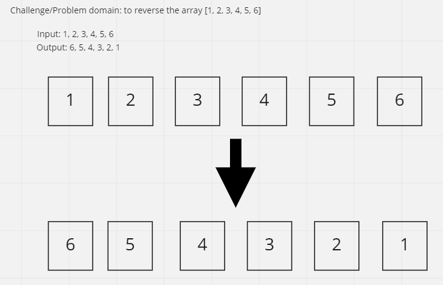

# Reverse Array

Include a function that takes in an array and returns the array with all the elements in reverse order.

## Inputs / Outputs

Input: `[1, 2, 3, 4, 5, 6]`\
Output: `[6, 5, 4, 3, 2, 1]`

## Algorithm

Swap values by grabbing the ends of the array

- Use a for loop to look at/iterate through all the elements in the array
- Swap each element with the inverse array index
- Go half-way through array and stop

## Pseudocode

(from Jacob/class01)
function Reverse-Array takes in `arr`:

declare start <- 0;
declare end <- length of arr minus 1;

while start <= end:
declare temp <- arr[start]
arr[start] <- arr[end]
arr[end] <- temp
start = start + 1
end = end - 1

## Actual Code

## Visual

