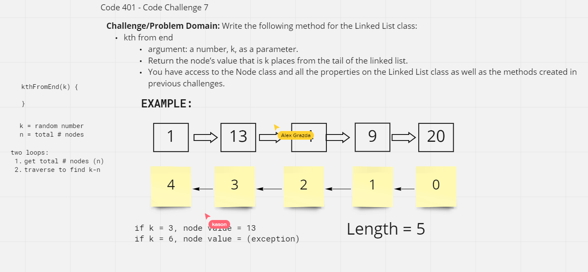
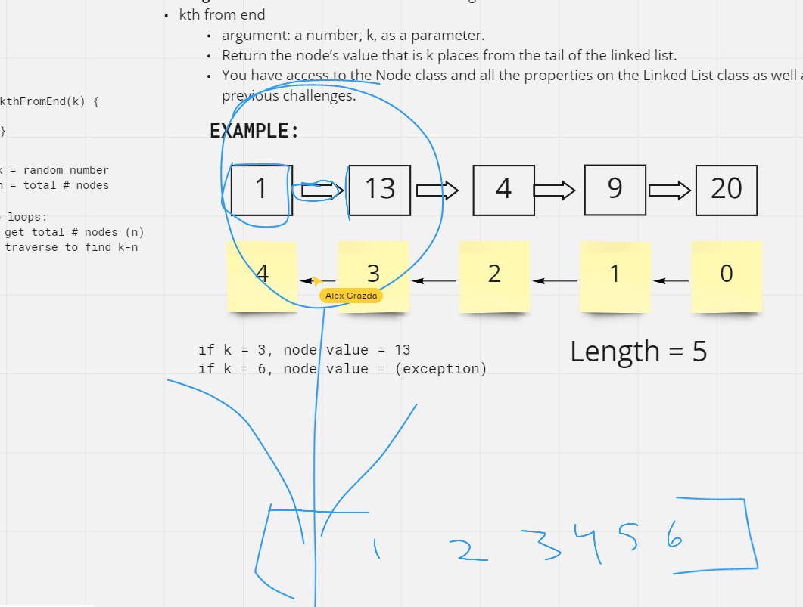
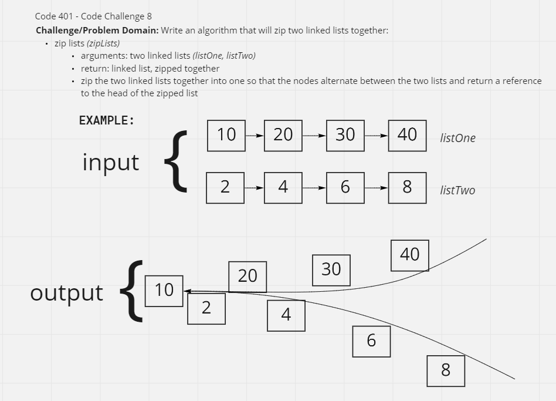

# Singly Linked Lists

Create a singly linked list and associated tests to ensure they are passing.

## Challenge

Create a Node class and Linked List classes with associated tests to prove functionality as noted below.

### Classes: `insert`, `includes`, `toString`

**Tests:**

- Can successfully instantiate an empty linked list
- Can properly insert into the linked list
- The head property will properly point to the first node in the linked list
- Can properly insert multiple nodes into the linked list
- Will return true when finding a value within the linked list that exists
- Will return false when searching for a value in the linked list that does not exist
- Can properly return a collection of all the values that exist in the linked list

### Classes: `append`, `insertBefore`, `insertAfter`

**Tests**

- Can successfully add a node to the end of the linked list
- Can successfully add multiple nodes to the end of a linked list
- Can successfully insert a node before a node located i the middle of a linked list
- Can successfully insert a node before the first node of a linked list
- Can successfully insert after a node in the middle of the linked list
- Can successfully insert a node after the last node of the linked list

### Class: `kthFromEnd`

**Tests:**

- Where k is greater than the length of the linked list
- Where k and the length of the list are the same
- Where k is not a positive integer
- Where the linked list is of a size 1
- “Happy Path” where k is not at the end, but somewhere in the middle of the linked list

### Class: `zipLists`

**Tests:**

- On this, and all future challenges, write tests for any cases that help you ensure your code is working as expected. Think through different edge cases to determine what tests will ensure your code is covered.

## Approach & Efficiency

**Class 5**\
_I worked with Jess Parker (props to her for helping these concepts make more sense!), and classmates Tray Chea and Alex Grazda to discuss the best ways to make create the methods as well as the tests._

**Class 6**\
_I worked with TAs (I can't remember their names!)_

**Class 7**\
_I worked closely with Kason Braley and Alex Grazda on this code challenge. Also thanks to Alex Beers for suggesting while loops._

_It was late...we got a bit loopy._

**Class 8**\

