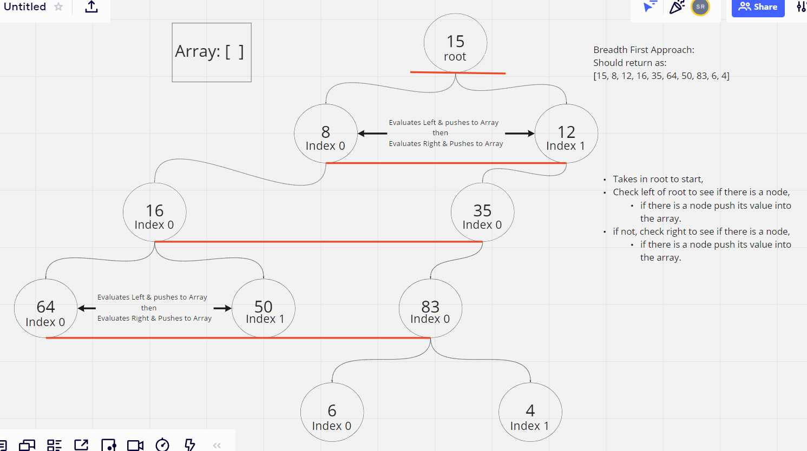

# Trees

<!-- Short summary or background information -->

## Challenge

### **Code Challenge 15: Binary Tree and BST Implementation**

BRANCH NAME: `trees`

**Node**

- Create a Node class that has properties for the value stored in the node, the left child node, and the right child node.

**Binary Tree**

Create a Binary Tree class:

- Define a method for each of the depth first traversals:
  - pre order
  - in order
  - post order which returns an array of the values, ordered appropriately.
- Any exceptions or errors that come from your code should be semantic, capture-able errors. For example, rather than a default error thrown by your language, your code should raise/throw a custom, semantic error that describes what went wrong in calling the methods you wrote for this lab.

**Binary Search Tree**

Create a Binary Search Tree class:

- This class should be a sub-class (or your languages equivalent) of the Binary Tree Class, with the following additional methods:
- Add
  - Arguments: value
  - Return: nothing
  - Adds a new node with that value in the correct location in the binary search tree.
- Contains
  - Argument: value
  - Returns: boolean, indicating whether or not the value is in the tree at least once.

### **Code Challenge 16: Find the Maximum Value in a Binary Tree**

BRANCH NAME: `tree-max`

Write the following method for the Binary Tree class:

- find maximum value
- Arguments: none
- Returns: number
- Find the maximum value stored in the tree. You can assume that the values stored in the Binary Tree will be numeric.

### **Code Challenge 17: Traverse a Binary Tree Breadth-first**

BRANCH NAME: `tree-breadth-first`

Write a function called breadth first:

- Arguments: tree
- Return: list of all values in the tree, in the order they were encountered

NOTES: Tray Chea and I worked closely together on this code challenge ensuring we both understood how the notation reflected the Nodes and their position in the tree

### **Code Challenge 18: Traverse and create a new KaryTree**

BRANCH NAME: `tree-fizz-buzz`

Write a function called fizz buzz tree:

- Arguments: k-ary tree
- Return: new k-ary tree
- Determine whether or not the value of each node is divisible by 3, 5 or both. Create a new tree with the same structure as the original, but the values modified as follows:
  - If the value is divisible by 3, replace the value with “Fizz”
  - If the value is divisible by 5, replace the value with “Buzz”
  - If the value is divisible by 3 and 5, replace the value with “FizzBuzz”
  - If the value is not divisible by 3 or 5, simply turn the number into a String.

## Code Challenge 15, 16

## Code Challenge 17

